# Will the Customer Accept the Coupon-An Exploratory Data Analysis

## Introduction
As a sales & marketing exercise, an entity isproviding Food & Beverage coupon to memebers of public driving through  or near a town.  Then the recipient of the coupon can:

    1. Accept the coupon - Yes
    2. Accept for later Use - Yes
    3. Reject the coupon - No.

This is short exploratory data analysis on the data from UCI Machine Learning Repository that was collected via a survey on Amazon Mechanical Turk.  

The goal is here is to analyse the historical data, visualize using Matplotlib, Seaborn, Pandas etc., and publish the findings on how the recipients responded and what factors could have influenced their decision whether to accept or reject the coupon. 

The data consists of approximately 12500 records consisting of  from  describes different driving scenarios, destinations, time, weather, fellow passengers, etc. 

The influencing factors are:
- Distance from the driver to the restaurant
- Time of day
- Weather
- Whether the driver is carrying passengers, kids, partner etc.
- Direction of travel
- Destination
- Expiration time for the coupon

In addition the other factors are:
Income, Marital status, Education, Occupation, eating and drinking habits, frequency, etc.

## Data Description, Data Cleaning and Data Preprocessing
The data was explored using pandas built in function and following observations were noticed.
1. Dataset has **12684** rows  
2. Dataset has **74 rows that are duplicated**. However as there is no unique id to identify an individual, we can assume these as just coincidental OR can be deleted. I have **deleted** them here
3. The following columns has missing data as below:
      1. car - in 12576 rows
      2. Bar - in 107 rows
      3. CoffeeHouse - in 217 rows
      4. CarryAway - in 151 rows
      5. RestaurantLessThan20 - in 130 rows
      6. Restaurant20To50 - in 189 rows             
4. The Column **'Passenger'** has incorrect spelling as **'Passanger'**
5. Time is saved as string. Copy it as new columns in Hour format
   
   
## Data Cleaning
1. Check for **nulls** in the data  
2. Check for **duplicates** and drop  
3. Convert the **time** field to standard hour format  
4. Update rows with **missing data** with **Unknown** keyword  
5. Update the column **'Passanger'** to **'Passenger'**  

After cleaning the data, deleting duplicate records, finally **12610** records were retained for EDA activity.

# Findings
The EDA was carried out for evaluating the Coupon acceptances for 'Bar' and 'Coffee House' coupons.  The findings are as described below. 

### Bar Chart & Grouped Bar Chart were used to visualize the data.

### 1. Proportion of total observations who chose to accept 'Bar' coupons. 

- Total Coupons Issued:  12610
- Total Coupons Accepted:  7157
- Percentage Accepting Coupons :  56.76%
- Total Coupons Not Accepted:  5453
- Percentage Accepting Coupons :  43.24%  

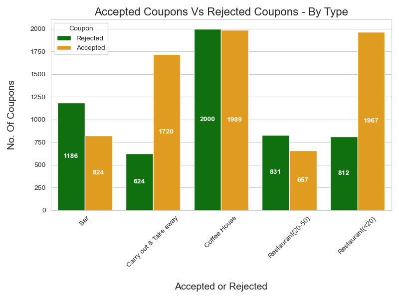

#### Inference :
Coffee House is **HIGH** for both **ACCEPTANCE and REJECTION**, and both have almost **SAME** proportion and same chance of either being accepted or rejected  
   Cheaper Restaurant coupons have about **2** rejections for **every 5** acceptances (812 vs 1967 coupons)  
   Carry out and Take away coupons have about **1** rejection for **every 3** acceptances (624 vs 1720 coupons)  
   Bar has higher rate of being rejected with **nearly 6 out of 10 being rejected** (1186  vs 824 coupons). Factors influeing this could be time of the day, kid passengers, weather, detour distance etc.

### 2. Coupons Issued By Type
The total coupons issued can be grouped into 5 Types  
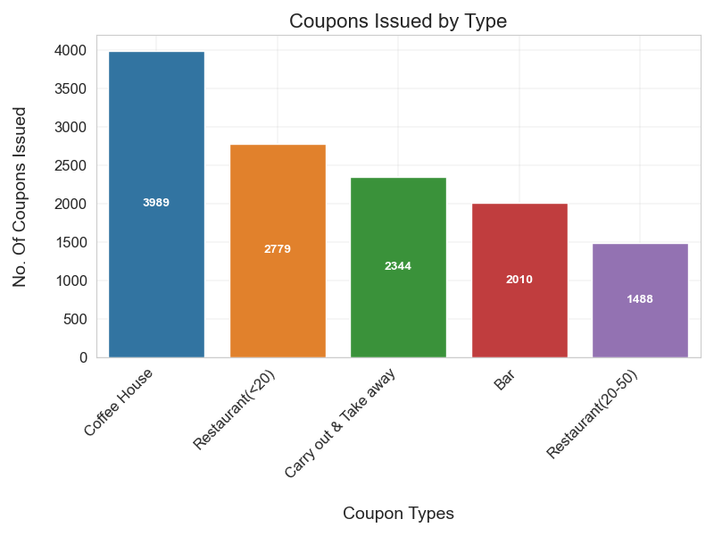  
### Inference : 
1. **Coffe House** seems to be most frequently issued coupons with **3989** coupons    
2. **Restaurant(<20)** has **2779** coupons
3. **Carry out & Take away** has **2344** coupons.
4. **Bar** has **2010** coupons
5. **Restaurant(20-50)** has the least **1488** coupons  

### 3. Coupon's issuance with varying Temperature was analysed.
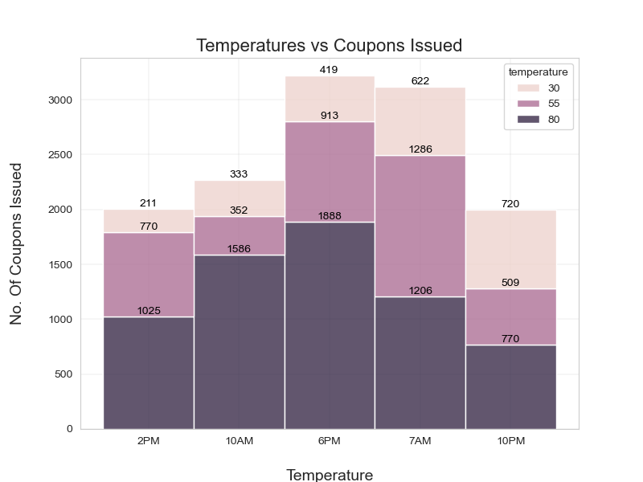
#### Inference:   
1. Hotter the weather, more coupons gets issued
2. At 6PM most coupons gets issued   
3. When the temperature is 80, **twice** the coupones as when the **temperature is 55** gets issued  
3. When the temperature is at **55**, again **twice** the coupon as when the **temperature is 55**  gets issued  

### 4. Coupon's acceptance with varying Temperature was analysed.

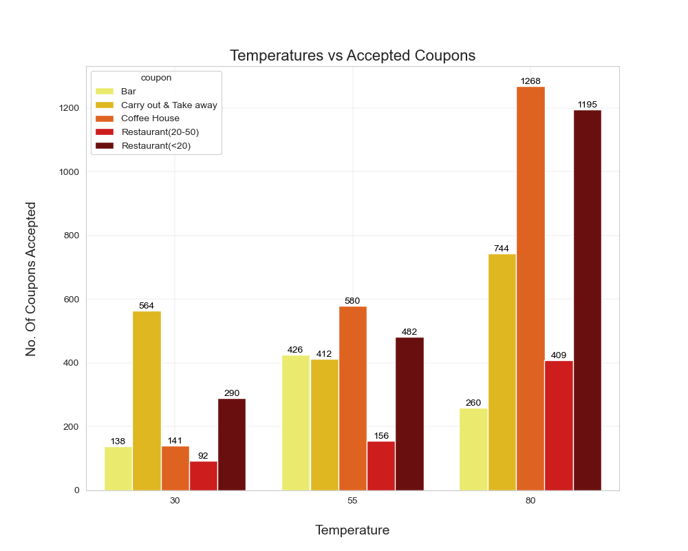
#### Inference : Data below shows how the Accepted coupons are distributed  :
1. When Temperature is LOW, drivers prefer to Carry Out & Take Aways
2.  When Temperature is MEDIUM, drivers' preference is more evenly distributed (barring expensive restaurant couplons)
3.  When Temperature is HIGH, drivers prefer Coffee House and Cheaper Restaurants-Restaurants(<20) 

### 5. Bar Coupons Acceptance by Proportion
#### Inference: 
- Total coupons for Bar : 2010
- Proportion of bar coupons accepted is : 824 (41.00%)
- Proportion of bar coupons not accepted is : 1186 (59.00%)

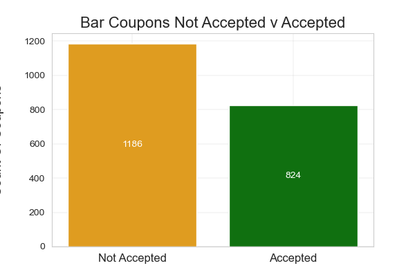

Out of **2010** coupons issued for Bar category **1186** drivers did **NOT** accept the coupon and about **824** drivers accepted the coupons. 
**Majority of the drivers (about 647) who did not accept the coupon**
   - Had kids with them OR  
   - Never been to a bar OR  
   - Been to bar between 1-3 times or Less than 1 (in prev month?)  

### 6. Comparing the Acceptance rates of Bar Coupons with respect to who went to bar 3 times or less to those who went more than 3 times

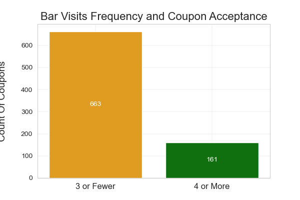

#### Inference:   
1. Out of **827** drivers who accepted **666** of them typically visited **bar 3 times or less**.  Only **161** of had visted bars 4 or more times. 
2. It appears like if liquor is being offered **free of cost**, even less frequent bar visitors are willing to stop by! 

### 7. Bar Coupons Acceptance rate by drivers who go to bar more than once and are over 25 years old with all other drivers
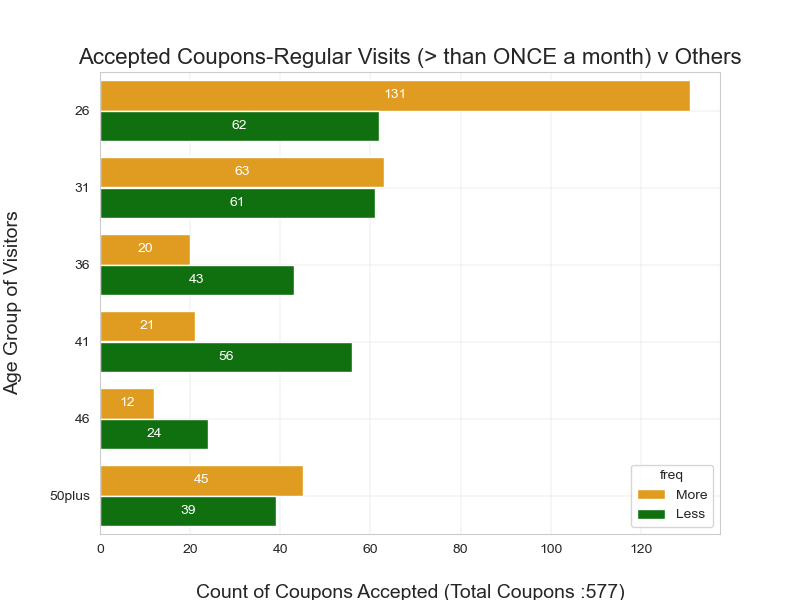
### Inference : 
The 'Bar' coupon acceptance seem to vary when with the age group. 
1. Younger drivers just over 25 used the coupon 131 times out of 580 accepted.  These 131 drivers had visited the bar more than once in contrast with 62 drivers who visited bar less than once.
2. Almost identical number of drivers accepted the coupons who were aged 31 and visited the bar more than once AND less than once.
3. In the age group between 36 to 50, drivers who visited the bar less accepted MORE coupons than the regular bar visitors
4. With drivers aged above 50, drivers who visit bar more accepted MORE coupons than the drivers who visit bar less frequently.

### 8. Bar Coupons Acceptance rate by drivers who go to bar more than once and had passengers who were NOT kids and occupation other than Farming, Fishing or Forestry
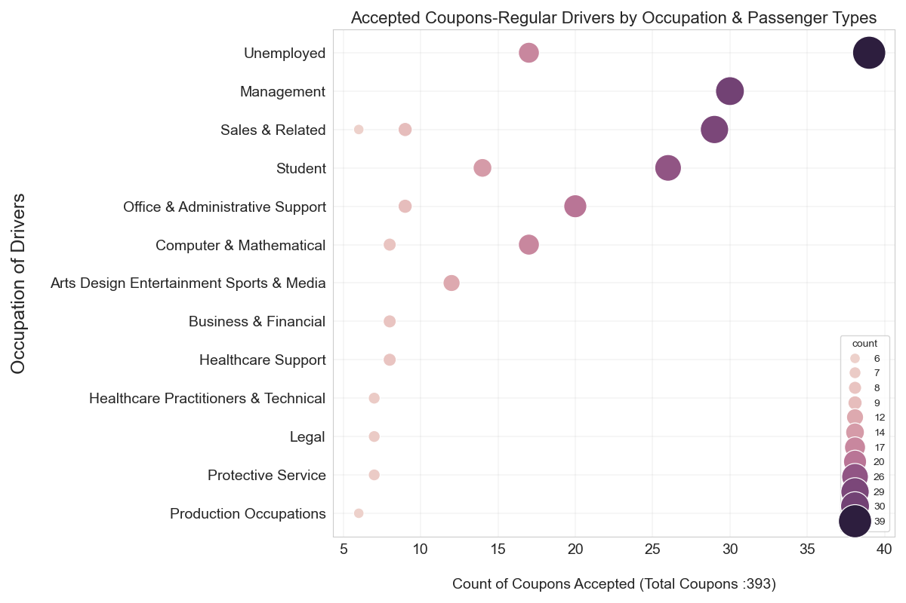
#### Inference : 
Here the age criteria of ABOVE 25 was removed and only Bar visits more than once a month, had passengers that were not kid and did not have occupation as Farming, fishing or forestry.

1. Surprisingly, 'Unemployed' drivers who go to bar more than once a month were the highest in using the bar coupon. They had the maximum number of passengers as well.
2. Following them were drivers who had occupation in Management.  Though they have fewer passengers .
3. Driver with Sales & Related occupation and Student drivers came in third and fourth in accepting bar coupons.
4. Drivers in other occupation seem less likely to accept the bar coupons.

### 9. Bar Coupons Acceptance rate 
- By drivers who go to bar more than once and had passengers who were NOT kids and NOT widowed OR
- By drivers who go to bar more than once and are under the age of 30 OR
- By drivers who go to cheap restaurants more than 4 times a month and income is less than 50K

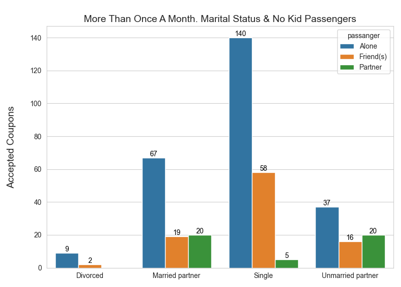
#### Inference :
- Here Single driver who go to bar more than once and had passengers who were NOT kids and NOT widowed accepted the bar coupons the most, Closely followed by single drivers who went with friends.
Married drivers  used the coupon the 2nd highest.
Divorced drivers used the coupon the least.

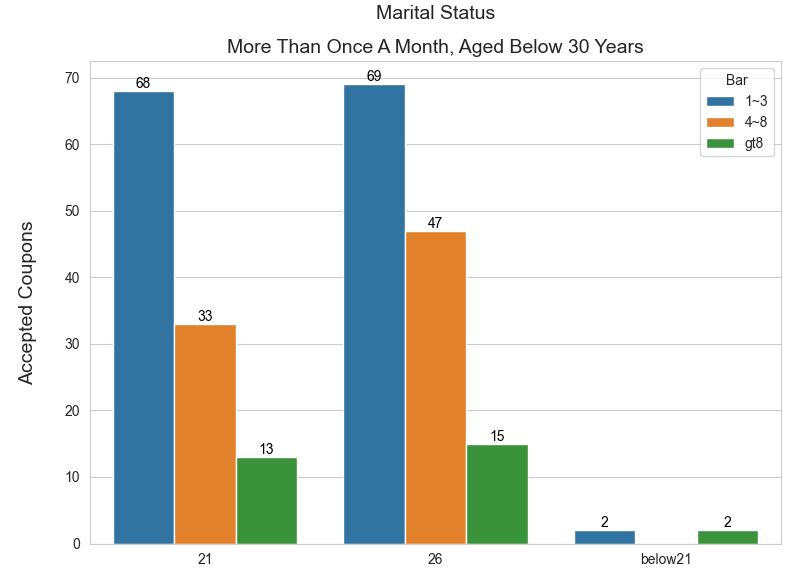
#### Inference :
- Drivers aged below 30 and go to bar between 1-3 times a month accepted the bar coupons the most. (137 coupons accepted by 21-30 age group)
- Drivers below 30, who go to bar more than 4-8 and beyond also used sizeable numbers of coupons. ( 107 coupons accepted by 21-30 age group) 
- Drivers below 21 did used the coupon only few times.

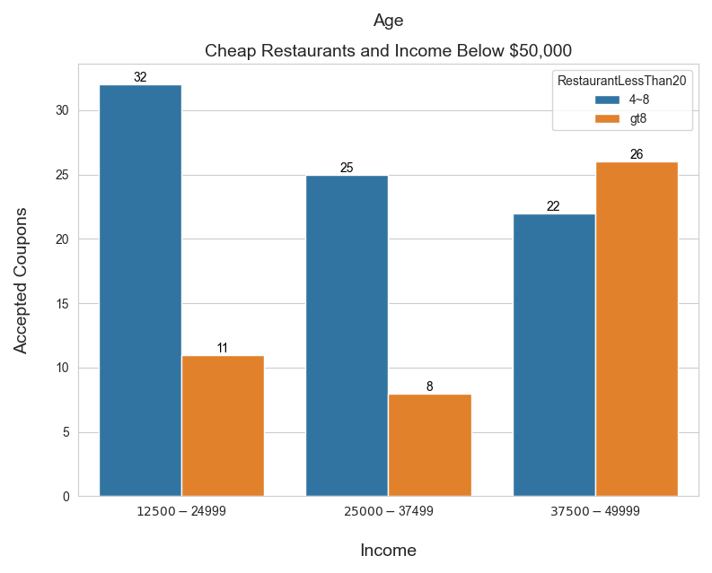
#### Inference :
- Drivers who go to cheap restaurants between 4-8 times a month and income is less than 25K accepted the restaurant coupons 32 times, followed by drivers with income between 25-37.5K who accepted 25 coupons., and lastly drivers with income between 37.5-50K who accepted 22 coupons.
- Drivers who  go to cheap restaurants more than 8 times a month and income is less than 25K accepted the restaurant coupons 11 times, followed by drivers with income between 25-37.5K who accepted 8 coupons., and lastly drivers with income between 37.5-50K who accepted 26 coupons.

## Hypothesis on Bar Coupons Acceptance
1. **Younger drivers** are more likely to accept the bar coupons than older drivers
2. **Unemployed drivers** are more likely to accept the bar coupons than drivers with other occupations
3. **Drivers who go to bar more than once a month** are more likely to accept the bar coupons than drivers who go less than once a month
4. **Drivers who go to bar more than once a month** and have passengers who are not kids are more likely to accept the bar coupons than drivers who have passengers who are kids
5. **Temperature** seems to have an impact on the acceptance of bar coupons. Drivers are more likely to accept the bar coupons when the temperature is high
6. **Drivers who go to bar more than once a month** and are under the age of 30 are more likely to accept the bar coupons than drivers who are older than 30
7. **Drivers who go to cheap restaurants more than 4 times a month** and have an income less than 50K are more likely to accept the restaurant coupons. 

# Independent investigation on "Coffee House" coupons
Here the same analysis as above for Bar was carried out for Coffee House coupons. The findings are as below.

## Findings

#### 1. Drivers who accepted Coffee House Coupons - Aged Below 40,  and have visited coffee house more than once in last 1 month

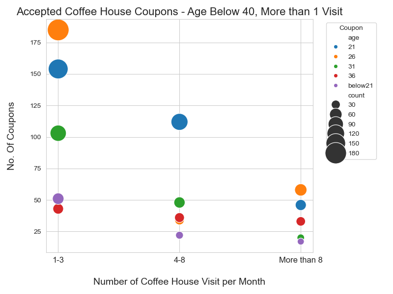

#### Inference :  
1. Drivers **above 21 & below 30** years appear to accept the Coffe House coupons than who are between **21 & 25** year and **below 21** years
2. About 175 drivers aged 26 and about 150 drivers aged 21 have accepted the coupon.  They visit the coffee house between1 to 3 times a month.
3. Drivers who visit between 4-5 times a month seem to moderately interested in accepting the coupons.

#### 2. Drivers who accepted Coffee House Coupons - Aged Below 40,  and have NEVER visited coffee House in last 1 month

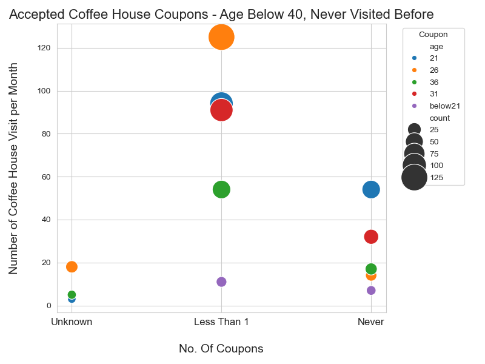
#### Inference:
- Drivers aged 26 who have visited never visited a coffe house appear to accept coffe house coupons the highest
- They closely followed by 21 year olds and 30 year olds who never been to a coffe house in last one month

#### 3. Drivers who accepted or rejected Coffee House Coupons based on time of the day

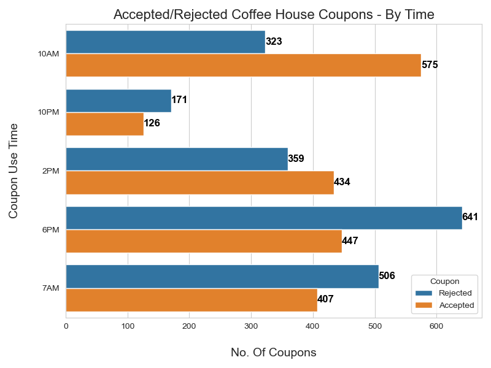

#### Inference
1. Morning **10 AM** seem to more favourable for coffee as coupon acceptance is **Twice** the rejected numbers  
2. Morning **7 AM** seem to not so favourable for coffee as coupon rejected more than it accepted. Probably driving to work  
3. During Afternoon **2 PM** time the acceptance and rejection are about the same ratio
2. 6PM time seems to be very popular for coffe house.  Nearly 640 drivers have accepted coupons against 447 rejections

## Hypothesis on Coffee House Coupons Acceptance
1. **Younger drivers** and visit coffee house between 1-3 time are more likely to accept the coffee house coupons than older drivers
2. **Drivers who go to coffee house more than 4-8 times** are less likely than the younger counterparts to accept the coffee house coupons.
3. **Drivers who go to coffee house more than  8 times** are least likely to accept the coffee house coupons in comparison with drivers who frequent less. 
4. Time of the day seems to have an impact on the acceptance of coffee house coupons. Drivers are more likely to accept the coffee house coupons at 7AM in the morning and 6PM in the evening than other times of the day. Though 2AM seems to have equal chances of acceptance and rejection.

## Next Steps
1. Further analysis can be carried out on the data to understand the acceptance of coupons based on other influencing factors like Time, Destination, Weather, direction of travel etc. to understand the acceptance of coupons.
2. Machine Learning models can be built to predict the acceptance of coupons based on the influencing factors.
3. To work out the correlation between the influencing factors and the acceptance of coupons manually is a tedious task. This can be automated using Machine Learning models.
4. The data can be further cleaned and preprocessed encode categories into numerical values so that it can be easily correlated and used in Machine Learning models.
5. The data can be split into training and testing data and models can be built to predict the acceptance of coupons.

## Conclusion
The data was analysed for the acceptance of Bar and Coffee House coupons. The data was visualized using Seaborn. 

